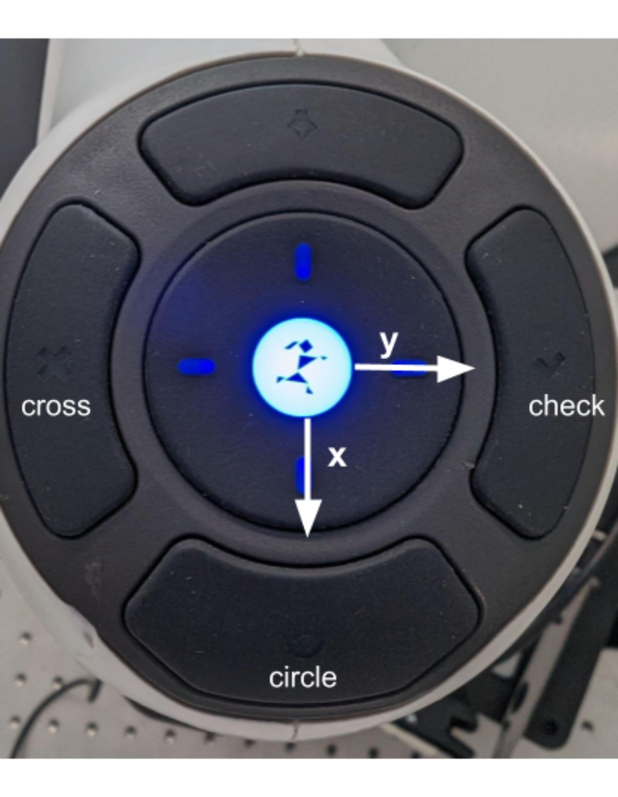

# CRISP_GYM

**CRISP_GYM_ITR** is based on **CRISP_GYM** and aims to make fine-tuning and deploying VLAs easy and fast.

## Features

- **Full Support:** Fully supports the CRISP ecosystem and the `CRISP_PY` API.
- **Data Recording:** Records manipulation data in the `LeRobotDataset v3.0` format.
- **Environment & Deployment:** Provides Pixi environments for `pi0.5` and `Groot N1.5` along with fast deployment scripts.

## **Prerequisites**

```jsx
#install pixi 
curl -fsSL https://pixi.sh/install.sh | bash
source ~/.bashrc
```

## Quick Start

```jsx
git clone [https://github.com/brianchang1025/crisp_gym_ITR](https://github.com/brianchang1025/crisp_gym_ITR).git
cd crisp_gym_ITR

export GIT_LFS_SKIP_SMUDGE=1
```

Create a file named `set_env.sh` and paste the code below into it. You can also add your own custom configuration paths to this file to suit your local environment.

```bash
export GIT_LFS_SKIP_SMUDGE=1

# Enable SVT logging (set to 1 to turn on; used by some tools/libraries)
export SVT_LOG=1

# ROS2 DDS domain ID — isolates ROS2 traffic between networks/processes
export ROS_DOMAIN_ID=100
export RMW_IMPLEMENTATION=rmw_cyclonedds_cpp
# CRISP config search path (colon-separated list of directories
# Replace the example paths with the actual config folders you want to use.
#export CRISP_CONFIG_PATH="/path/to/config1:/path/to/config2"
```

You can now install the Pixi environments. We provide separate environments for the **PI05** and the **Nvidia GROOT N1.5** models. 

```jsx
# lerobot dataset record env
pixi install -e jazzy-lerobot
pixi run -e jazzy-lerobot python -c "import crisp_gym"

# pi05 pixi env
pixi install -e jazzy-pi05
pixi run -e jazzy-pi05 python -c "import crisp_gym" 

# groot pixi env
pixi install -e jazzy-groot
pixi run -e jazzy-groot python -c "import crisp_gym"
```

You can verify if your configuration has loaded correctly by running the following command:

```bash
pixi run -e jazzy-lerob crisp-check-config
```

if this work we can move to next step 

## Dataset Recording

You can start recording your dataset by running the following command:

```bash
# login huggingface, you only do this once
pixi run -e jazzy-lerobot hf auth login 

pixi run -e jazzy-lerobot crisp-record-leader-follower \
   --repo-id huggingface_username/dataset_repo_name --task "the task description" \
   --num-episodes int 
```

Once the recording interface opens, you can select your hardware settings for the teleoperation **leader** and **follower**. For detailed instructions on how to set up your own leader and follower configurations, please check the [placeholder].

You can use the `--resume` flag to continue recording to an existing dataset. Additionally, use the `--recording-manager-type` argument to choose between `keyboard` or `ros` control. If you select `ros`, you can manage the recording process directly using the buttons on the leader arm.

```bash
pipixi run -e jazzy-pi05 crisp-record-leader-follower \
   --repo-id <your_huggingface_account>/<repo_name> --task <the task description> \
   --num-episodes <int> --recoring-manager-type "ros"
   
```

When using the ROS manager, you can control the recording using the buttons on the leader arm:

- Press the **Circle** button to start or stop recording an episode.
- Press the **Check** button to save the current recording.
- Press the **Cross** button to delete the current recording.-



---

## Fine-tuning

Once you have finished collecting your dataset, you can begin fine-tuning the VLA model. We provide simple training scripts, `train_pi05.sh` and `train_groot.sh`, located in the `scripts/` folder. **Note:** Before running these, you must edit the arguments within the files (such as `dataset_repo` and `policy_repo`)

```jsx
	// pi05
	chmod +x scripts/train_pi05.sh
	scripts/train_pi05.sh
	
	// groot
	chmod +x scripts/train_pi05.sh
	scripts/train_pi05.sh
```

For users who prefer containerized environments, we provide dedicated **Dockerfiles** for both the **PI05** and **Nvidia GROOT N1.5** models in the `docker/` folder.

To simplify the setup, use the provided automation script to build your image and launch the container:

```bash
# automation script to build your image and launch the container:
./docker/build_and_run_docker.sh
```

Once you have entered the container, you can find the training scripts for the **PI05** and **GROOT** policies in the `/workspace/docker` directory. Simply edit the arguments within these scripts to match your requirements and run them to begin the training process.

```bash
# log in to hf and wandb for the first time entering the container
hf auth login 
wandb login 

# train script for pi05
./docker/docker_train_pi05.sh
# train script for groot
./docker/docker_train_groot.sh
```

---

## Inference

Once you have finished fine-tuning your model or have downloaded a pre-trained policy from the Hugging Face Hub, you can begin running inference to test your policy on the hardware.

```bash
#deploy pi05 policy
pixi run -e jazzy-pi05 crisp-deploy-vla --path <your policy path> --task <the task description> \
--repo-id <your_huggingface_account>/<repo_name>
```

## Setting Your Own Config

### Leader and Follower

You can set your own leader and follower configurations in `/crisp_gym/teleop/teleop_robot_config.py` and `/crisp_gym/envs/manipulator_env_config.py` separately.

```python
# Example for leader config
@dataclass
class RightPandaTeleopRobotConfig(TeleopRobotConfig):
    """Configuration for the right robot as a leader."""

    leader: RobotConfig = field(default_factory=lambda: PandaConfig())
    leader_gripper: GripperConfig | None = field(
        default_factory=lambda: GripperConfig.from_yaml(
            path=(find_config("grippers/gripper_right.yaml")).resolve()
        )
    )

    gravity_compensation_controller: Path = field(
        default_factory=lambda: find_config("control/gravity_compensation.yaml")
    )

    leader_namespace = "right"
    leader_gripper_namespace = "right"
```

```python
#Example for follower config
@dataclass
class FrankaGripperPandaEnvConfig(PandaEnvConfig):
    """Custom Panda Gym Environment Configuration for Panda with an Franka gripper and cameras."""

    gripper_config: GripperConfig | None = field(
        default_factory=lambda: GripperConfig.from_yaml(
            path=(
                find_config("grippers/panda_gripper.yaml") or CRISP_CONFIG_PATH / "grippers" / "panda_gripper.yaml"
            ).resolve()
        )
    )
    camera_configs: List[CameraConfig] = field(
        default_factory=lambda: [
            CameraConfig(
                camera_name="primary",
                camera_frame="primary_link",
                resolution=[256, 256],
                camera_color_image_topic="/camera/third_person_camera/color/image_raw",
                camera_color_info_topic="/camera/third_person_camera/color/camera_info",
            ),
            CameraConfig(
                camera_name="wrist",
                camera_frame="wrist_link",
                resolution=[256, 256],
                camera_color_image_topic="/camera/wrist_camera/color/image_rect_raw",
                camera_color_info_topic="/camera/wrist_camera/color/camera_info",
            ),
        ]
    )

    max_episode_steps: int | None = 1000
```

After setting your own config, you need to register it in the `STRING_TO_CONFIG` section located at the end of each Python file. Only after you register it will the config show up in the record and deploy interface.

### CRISP_PY

`crisp_py` provides the Python API for controlling the robot, as well as configurations for controller parameters and equipment. Currently, the `crisp_py` version used in this repository is `crisp_py_ITR`. You can also import your own version by replacing the link in the `pixi.toml` file.

```xml
crisp-python = { git = "[https://github.com/brianchang1025/crisp_py_panda](https://github.com/brianchang1025/crisp_py_panda)"}
```

## Acknowledgements

This project is built heavily on `CRISP_GYM` and `CRISP_PY`. Check their official project website for more detailed information and instructions on how to modify your own CRISP version.

**CRISP :** https://learnsyslab.github.io/crisp_controllers/